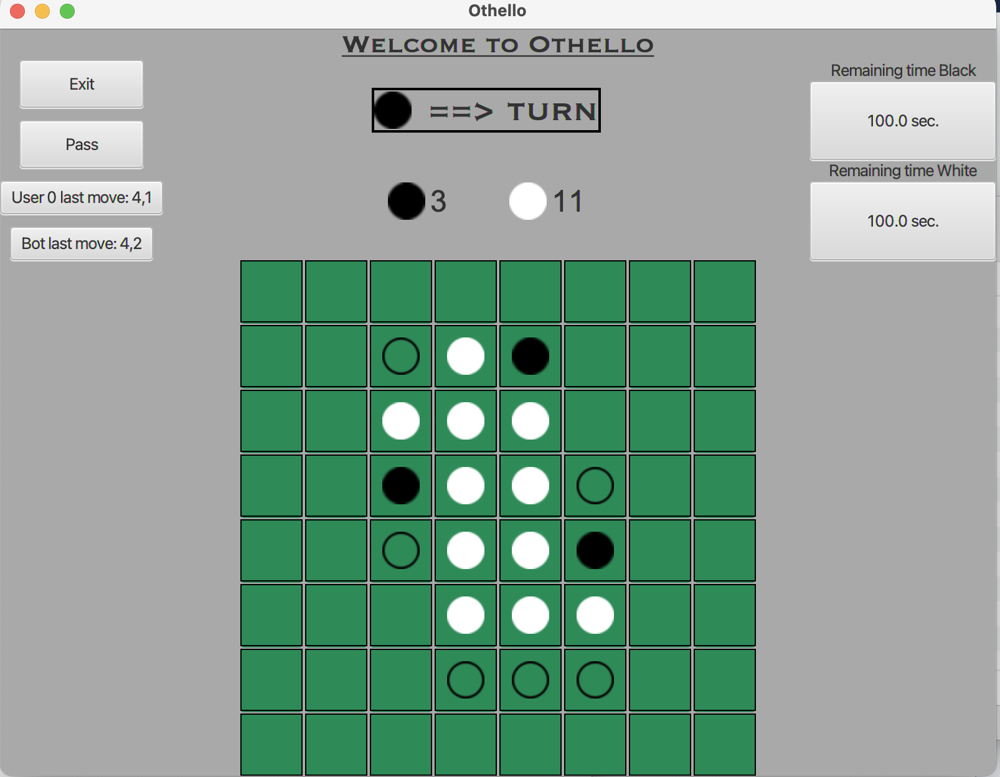

# Othello

## About 
Implementation of strategy board game Othello with command line and GUI interface.
This project was done during the course [Programmierpraktikum Bioinformatik](https://www.bio.ifi.lmu.de/studium/ws2020/prk_prog/) at LMU Munich university.

## Othello Game
According to [eothello.com](https://www.eothello.com/) Othello "is a strategy board game for two players (Black and White), played on an 8 by 8 board. The game traditionally begins with four discs placed in the middle of the board as shown below. Black moves first."

Please visit [How to Play Othello?](https://www.eothello.com/#how-to-play) to get to know the rules

